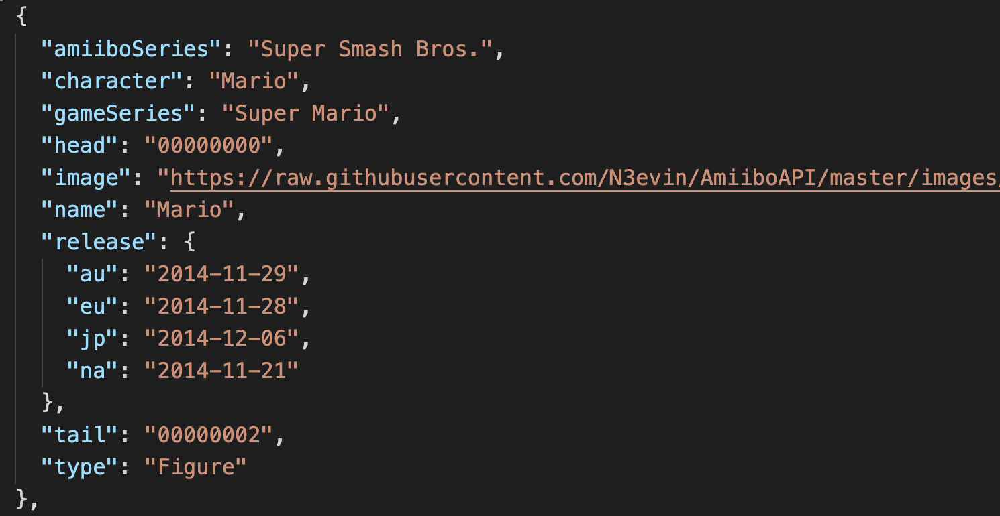

# Amiibo API Project

## Description

This is a RESTful API that covers all the various Amiibos that are available. Data was originally pulled from [https://www.amiiboapi.com/](https://www.amiiboapi.com/). The toughest part of this project was just finding an API that had a decent set of data that I could work with. Other than that, setting up and testing the routes was a bit of a trial but I believe that I was able to work out everything that I set out to do. 

This version is set up to run on your localhost.

## Requirements

- [Node JS](https://nodejs.org/en/)
- [Mongo DB](https://www.mongodb.com/download-center)

## Installation

First install the requirements. Then download this repo to your hard drive. You'll then need to use `npm install` in the root of the amiibo_api folder to install dependencies. It should install axios, body-parse, express, mongoose, and node-fetch. 

You'll then need to go to the `/src/db/` folder and use either the Axios or the Fetch versions of GrabData to obtain the json file needed to seed your database. Either one of the following commands will work:

```
node GrabData_axios.js
node GrabData_fetch.js
```

Sample of the data:

Tale and Head are **not** used in this project. Image will be used when implementing the front end. EU and AU in the release dates are also **not** used.

You will now have a json file for seeding your database. `seed.js` is currently set up to use the Fetch version of the json file. You will needed to edit the name of the file if you used the Axios version. Use the command, `node seed.js` to send the data to a Mongo database. If you get any errors, make sure that the Mongo server is started. You can use `top | grep mongod` in the terminal to see if the process is already running. If it's not, use `mongod` to start it up.

## Usage

The following routes are currently set to be used. You can test GET by running `nodemon` in the `/src` folder and go to `localhost:3000` in your browser. You can also use [Postman](https://www.getpostman.com/) to test everything out. Replace DOMAIN with either localhost:3000 or whatever domain you have the API installed on.

| Route                                                         | URL                                                                 | Method | Description                                                                       |
| ------------------------------------------------------------- | :------------------------------------------------------------------ | :----- | :-------------------------------------------------------------------------------- |
| <sub>"/"</sub>                                                | <sub>http://DOMAIN/</sub>                                           | GET    | <sub>Redirects the root to the amiibo resource.</sub>                             |
| <sub>"/amiibo"</sub>                                          | <sub>http://DOMAIN/amiibo</sub>                                     | GET    | <sub>Main resource that lists the entire database.</sub>                          |
| <sub>"/amiibo/id/:id"</sub>                                   | <sub>http://DOMAIN/id/<"id"></sub>                                  | GET    | <sub>Searching by ID.</sub>                                                       |
| <sub>"/amiibo/releaseNA/:release"</sub>                       | <sub>http://DOMAIN/realeaseNA/<"date"></sub>                        | GET    | <sub>Search by North American Release dates. The date format is YYYY-MM-DD.</sub> |
| <sub>"/amiibo/releaseRangeNA/:releaseStart/:releaseEnd"</sub> | <sub>http://DOMAIN/releaseRangeNA/<"Start Date">/<"End Date"></sub> | GET    | <sub>Search by a range of dates for North American Releases.</sub>                |
| <sub>"/amiibo/releaseJP/:release"</sub>                       | <sub>http://DOMAIN/realeaseJP/<"date"></sub>                        | GET    | <sub>Search by Japanese dates. The date format is YYYY-MM-DD.</sub>               |
| <sub>"/amiibo/releaseRangeJP/:releaseStart/:releaseEnd"</sub> | <sub>http://DOMAIN/releaseRangeJP/<"Start Date">/<"End Date"></sub> | GET    | <sub>Search by a range of dates for North Japanese Releases.</sub>                |
| <sub>"/amiibo/name/:name"</sub>                               | <sub>http://DOMAIN/name/<"name"></sub>                              | GET    | <sub>Search by name.</sub>                                                        |
| <sub>"/amiibo/character/:character"</sub>                     | <sub>http://DOMAIN/character/<"character"></sub>                    | GET    | <sub>Search by character name.</sub>                                              |
| <sub>"/amiibo/type/:type"</sub>                               | <sub>http://DOMAIN/type/<"type"></sub>                              | GET    | <sub>Search by type (Card/Figure).</sub>                                          |
| <sub>"/amiibo"</sub>                                          | <sub>http://DOMAIN/amiibo</sub>                                     | POST   | <sub>Creates Amiibo listing.</sub>                                                |
| <sub>"/amiibo/id/:id" </sub>                                  | <sub>http://DOMAIN/id/<"id"></sub>                                  | PUT    | <sub>Edits an Amiibo listing</sub>                                                |
| <sub>"/amiibo/id/:id"</sub>                                   | <sub>http://DOMAIN/id/<"id"></sub>                                  | DELETE | <sub>Deletes an Amiibo listing</sub>                                              |

If you're testing things out with Postman, you'll need to use these values in under Header:

```
KEY: Content-Type
VALUE: application/json
```

This is the format for adding and updating data:

```
{
    "amiiboSeries": "Super Smash Bros.",
    "character": "Mario",
    "gameSeries": "Super Mario",
    "head": "00000000",
    "image": "https://raw.githubusercontent.com/N3evin/AmiiboAPI/master/images/icon_00000000-00000002.png",
    "name": "Mario",
    "release": {
      "au": "2014-11-29",
      "eu": "2014-11-28",
      "jp": "2014-12-06",
      "na": "2014-11-21"
    },
    "tail": "00000002",
    "type": "Figure"
  }
```

## Author

William Chrapcynski: all code

[Nevin Vu](https://www.amiiboapi.com/): Data
